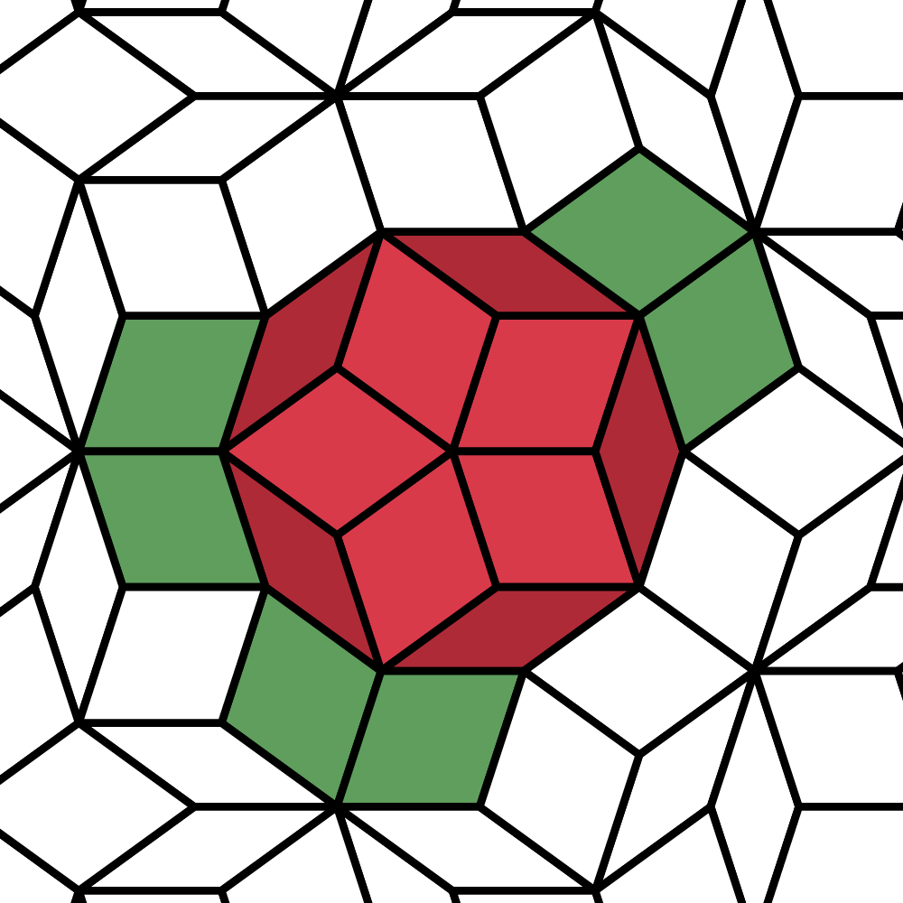
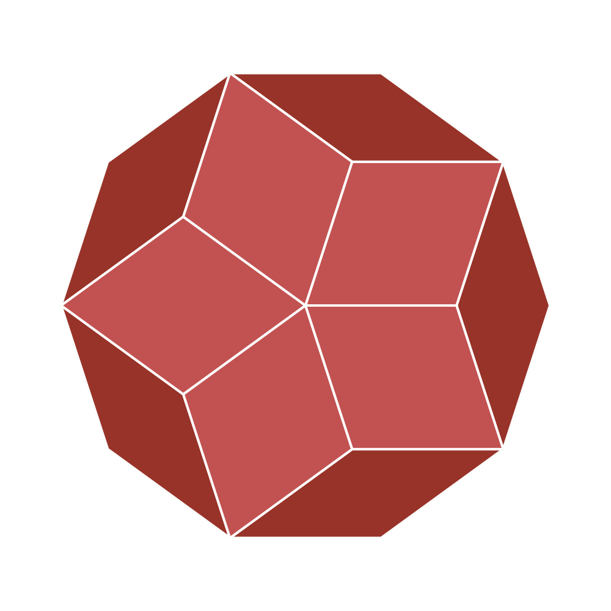
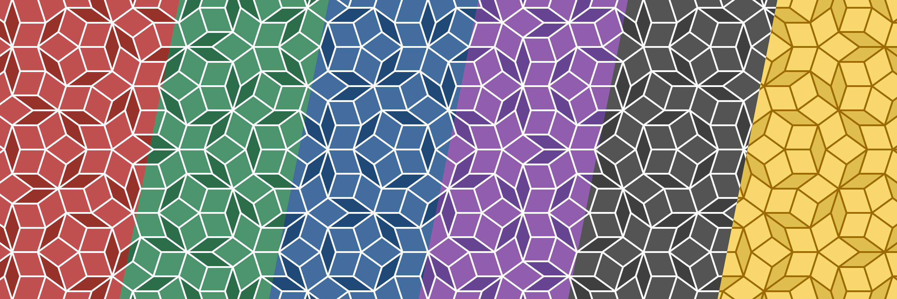

# rose

[Check out the live demo!](https://bpandreotti.github.io/rose/)

`rose` is a [Penrose tiling](https://en.wikipedia.org/wiki/Penrose_tiling) generator written in Rust

## Usage

Clone the repository and run `cargo run -- out.svg` to generate a tiling using the default options. `rose` will create an SVG file that can be viewed in a web browser.

## Options

Run `rose --help` to see a full list of arguments.

### Number of generations

Use `-n <num-generations>` to control how many decomposition steps should be made.

### Seeds

You can change the starting seed for the tiling with `--seed <seed>`. There are four available seeds: `rose`, `large-rhombus`, `small-rhombus` and `pizza`. This will change the shape of the Penrose tiling.

### Appearance

Use `-s <color-scheme>` to change the appearance of the tiling. There are 6 available color schemes: `red`, `green`, `blue`, `purple`, `grey` and `yellow`,

You can also use the `--colors` and `--stroke-color` options to create your own custom color scheme. See `--help` for more ways to customize the appearance of the Penrose tiling.

### Show arcs and triangles

You can use the `--draw-triangles` flag to skip the triangle merging step and render the Robinson triangles used to generate the tiling. The `--draw-arcs` flag will render colored arcs to show the tile matching rules.
